# ✈️ Awesome Flight Simulation & Video Games 🚀

  

    

> **🌟 The Ultimate Curated List of Commercial Flight Simulator Games & Open-Source Aerospace GitHub Projects** 🛩️  
> *Discover top-rated PC flight simulators 💻, realistic 6DoF combat dynamics ⚔️, space flight simulators 🌌, and WebGL browser-based flying games 🌐.*

**📅 Last updated: October 2026**

---

## 🎯 Overview & Key Topics

Welcome to the definitive index of **flight simulation software** 🛩️, **commercial flight video games** 🎮, and **open-source flight simulators** 🔓. Whether you are looking for photorealistic VR flight simulators 🥽, combat air warfare 💥 (DCS World, IL-2 Sturmovik), FAA-approved pilot training tools 👨‍✈️ (X-Plane 12, Prepar3D), space flight mechanics 🪐 (Orbiter), or open-source flight dynamics models 🛠️ (JSBSim, FlightGear), this list covers all major platforms (Windows 🪟, macOS 🍎, Linux 🐧, WebGL 🌐, Android 🤖, iOS 📱).

### 🔑 Key Categories Covered:
- **✈️ Civil Aviation & Pilot Training**: Microsoft Flight Simulator 2024, X-Plane 12, Prepar3D v6, Aerofly FS 4.
- **⚔️ Combat & Military Dogfighting**: DCS World, IL-2 Sturmovik: Battle of Stalingrad, BVR Sim.
- **🔓 Open-Source Flight Simulators & FDM Engines**: FlightGear, JSBSim 6DoF Flight Dynamics, YSFlight CE.
- **🚀 Space Flight & Orbital Mechanics**: Orbiter Space Flight Simulator, OpenOrbiterSim.
- **🌐 Browser-Based & WebGL Flight Simulators**: GeoFS, OpenSkyFlight (Three.js), web-flight-simulator (CesiumJS).
- **📱 Mobile Flight Simulators**: Infinite Flight Pro, Aerofly FS Mobile.

---

## 📖 Table of Contents

- [✈️ Commercial Flight Simulators](#️-commercial-flight-simulators)
- [🔓 Open-Source GitHub Flight Projects](#-open-source-github-flight-projects)
- [🤝 How to Contribute](#-how-to-contribute)
- [💖 Support & Sponsorship](#-support--sponsorship)
- [⚠️ Disclaimer & Market Analysis](#️-disclaimer--market-analysis)
- [📈 Star History](#-star-history)

---

## ✈️ Commercial Flight Simulators

> **📊 Market Context**: The global flight simulation market is estimated at **~$1.5B in 2026**, growing toward **~$3B by 2032**. The consumer tier is led by **Microsoft Flight Simulator 2024** (~$51.7M gross revenue on Steam), alongside **X-Plane 12** and **Prepar3D** for commercial pilot training and FAA certification.

| Game / Simulator | Description & Key Features | Pricing (Starting Tier) | Free Tier / Demo | Platform Support |
|------------------|----------------------------|------------------------|------------------|------------------|
| **[Microsoft Flight Simulator 2024](https://www.flightsimulator.com/)** ✈️ | **Flagship consumer flight simulator.** Photorealistic global terrain streaming, live real-world weather, and comprehensive aircraft fleet. | **Standard**: **$69.99** **Deluxe**: **$99.99** **Premium Deluxe**: **$129.99** **Aviator**: **$199.99** | Included in **Xbox Game Pass**. No standalone free tier. | Windows 🪟, Xbox 🎮, Cloud ☁️ |
| **[X-Plane 12](https://www.x-plane.com/)** 🛩️ | **Advanced flight dynamics simulator.** Uses blade element theory, FAA-certifiable for flight schools and pilot logbooks. | **Digital Download**: **$59.99** **DVD Edition**: **$99.99** | **Free Demo** available with time-limited flight zone. | Windows 🪟, macOS 🍎, Linux 🐧 |
| **[Prepar3D v6](https://www.prepar3d.com/)** 🛫 | **Lockheed Martin's professional flight training platform.** Built on Microsoft ESP technology for military, academic, and professional training. | **Personal**: **$59.95** **Professional**: **$350.00** **Developer**: **$9.95/mo** | Academic license available at **$59.95**. | Windows 🪟 |
| **[DCS World](https://www.digitalcombatsimulator.com/)** ⚔️ | **The gold standard for military combat flight simulation.** High-fidelity clickable cockpits, radar systems, and realistic weapon physics. | **Free-to-Play** core game. Aircraft Modules: **$15.00 – $80.00** (e.g. F-14B: $49.99). | **Free base game** includes Su-25T and TF-51D Mustang with Caucasus map. | Windows 🪟 |
| **[IL-2 Sturmovik](https://il2sturmovik.com/)** 🛩️ | **WWII & WWI aerial combat flight simulator.** Advanced damage modeling, ballistic modeling, and historical WWII dogfights. | **IL-2 Sturmovik: 1946**: **$9.99** **Battle of Stalingrad**: **~$50.00** **Premium Bundles**: **$84.63** | No perpetual free tier; periodic free trial weekends on Steam. | Windows 🪟 |
| **[Aerofly FS 4](https://www.aerofly.com/)** 🚁 | **High-performance flight simulator.** Ultra-fast loading times, VR native support, and detailed scenery for PC and mobile. | **Steam**: **$59.99** (Deluxe: **$79.98**) **Mobile Apps**: **$49.99** | In-app purchases for additional aircraft bundles. | Windows 🪟, macOS 🍎, iOS 📱, Android 🤖 |
| **[GeoFS](https://www.geo-fs.com/)** 🌐 | **Accessible web browser flight simulator.** Runs instantly in browser using global aerial imagery and real-time multiplayer. | **Free** (Standard 10m imagery) **HD Subscription**: **~$10–15/year** | **Free Tier** with global coverage, playable on Chromebooks & low-end PCs. | Web Browser 🌐, Mobile 📱 |
| **[Infinite Flight](https://infiniteflight.com/)** 📱 | **Premier mobile flight simulator.** Live ATC multiplayer, global satellite imagery, real-time meteorology, and autopilot. | **Free Download** **Pro Monthly**: **$10.49** **Pro Annual**: **$84.99** | **Free tier** includes basic aircraft and default flight regions. | iOS 📱, Android 🤖 |
| **[Flight Sim World](https://store.steampowered.com/)** 🚫 | **Discontinued flight simulator (Dovetail Games).** Built on Unreal Engine 4 with GA aircraft focus. | **N/A** (Discontinued) | Service terminated; no longer available for purchase. | Windows 🪟 |

---

## 🔓 Open-Source GitHub Flight Projects

The open-source flight simulation ecosystem is mature and actively used in academic aerospace research 🧪, AI reinforcement learning 🤖, and indie game development 🎮.

| Repository | Category & Description | License | GitHub Stars |
|------------|------------------------|---------|--------------|
| **[Orbiter Space Simulator](https://github.com/orbitersim/orbiter)** 🚀 | **Open-source space flight simulator.** Realistic Newtonian mechanics, orbital maneuvers, planetary physics, and spacecraft simulation. | **MIT License** |  (~1,975) |
| **[JSBSim FDM](https://github.com/JSBSim-Team/jsbsim)** ⚙️ | **Open-source 6DoF Flight Dynamics Model.** C++ library for non-linear flight dynamics used in FlightGear, BVR Sim, and aerospace engineering. | **LGPL-2.1** |  (~2,200) |
| **[FlightGear](https://github.com/FlightGear/flightgear)** 🛩️ | **Flagship open-source flight simulator.** Over 990K lines of code, open scenery databases, and multi-aircraft support across all OS platforms. | **GPL-2.0** |  (~692) |
| **[web-flight-simulator](https://github.com/dimartarmizi/web-flight-simulator)** 🌐 | **Browser-based 3D flight simulator.** Built with Three.js + CesiumJS for rendering real-world elevation and terrain maps in WebGL. | **MIT** |  (~575) |
| **[OpenSkyFlight](https://github.com/jeanjerome/OpenSkyFlight)** 🌤️ | **WebGL browser flight sim over real terrain.** Uses Three.js with satellite imagery, adaptive terrain LOD, and interactive head-up display (HUD). | **MIT** |  (~300) |
| **[YSFlight Community Edition](https://github.com/XA-38/YSCE)** 🛩️ | **Lightweight open-source flight simulator engine.** Modernized community fork of Soji Yamakawa's classic YSFlight (1999). | **BSD 3-Clause** |  (~200) |
| **[BVR Sim](https://github.com/lizi-Margin/bvr_sim)** 🤖 | **Beyond-Visual-Range air combat RL environment.** Gymnasium-compatible Python framework powered by JSBSim backend for autonomous jet dogfighting. | **GPL-3.0** |  (~200) |
| **[Fighters Legacy](https://github.com/fighters-legacy/fighters-legacy)** ⚔️ | **Moddable combat flight simulator engine.** Inspired by Jane's Fighters Anthology, featuring custom aircraft plugins and mod support. | **Open Source** |  (~100) |

### 🛠️ Additional Open-Source Aerospace Libraries & Tools
- **[OpenFlightSim](https://github.com/UASLab/OpenFlightSim)** 🛩️: Research-grade UAV and aircraft flight simulation framework.
- **[SimGear](https://github.com/FlightGear/simgear)** ⚙️: Core C++ 3D graphics and simulation engine powering FlightGear.
- **[OpenOrbiterSim](https://github.com/OpenOrbiterSim)** 🚀: Community-driven engine fork of Orbiter Space Simulator.
- **[MSFS 2024 Developer Tools](https://github.com/topics/msfs-2024)** 🛠️: Open-source SDK scripts, blender plugins, and scenery mods for MSFS 2024.

---

## 🤝 How to Contribute

Contributions to expand this list of flight simulators and aerospace projects are always welcome! ✨

1. **Fork** 🍴 this repository.
2. Edit `README.md` following the table structure above.
3. Provide: Name, direct URL, accurate description, pricing, and project license.
4. Submit a **Pull Request (PR)** 📥 with a summary of added/modified flight software.

---

## 💖 Support & Sponsorship

Thank you so much for exploring and supporting this curated resource! 🙏

If you find this repository helpful, please consider showing your support:
- ⭐ **Star** this repository to help others discover it.
- 🍴 **Fork** and share it with fellow aviation enthusiasts, developers, and researchers.
- ☕ **Sponsor / Buy me a coffee**: If you'd like to support ongoing open-source development and curation, check out the [GitHub Sponsor Dashboard](https://github.com/sponsors/ishandutta2007).

---

## ⚠️ Disclaimer & Market Analysis

- **Community Maintained**: This list is curated by flight simulation enthusiasts and researchers for educational and informational purposes.
- **Pricing & Subscriptions**: Prices are subject to vendor updates. Always check official game sites for current promotions and VR capability requirements.
- **Commercial vs. Open-Source**: While commercial titles (MSFS 2024, X-Plane 12) lead in visual fidelity and cloud terrain streaming, open-source projects like **FlightGear** and **JSBSim** provide unmatched customization for engineering, aerodynamics research, and autonomous flight training.

---

## 📈 Star History

---

**Keywords**: *Flight Simulation, Flight Simulator Video Games, Microsoft Flight Simulator 2024, X-Plane 12, DCS World, FlightGear, JSBSim, Space Flight Simulator, WebGL Flight Sim, Free Flight Games, Open Source Flight Dynamics.*

